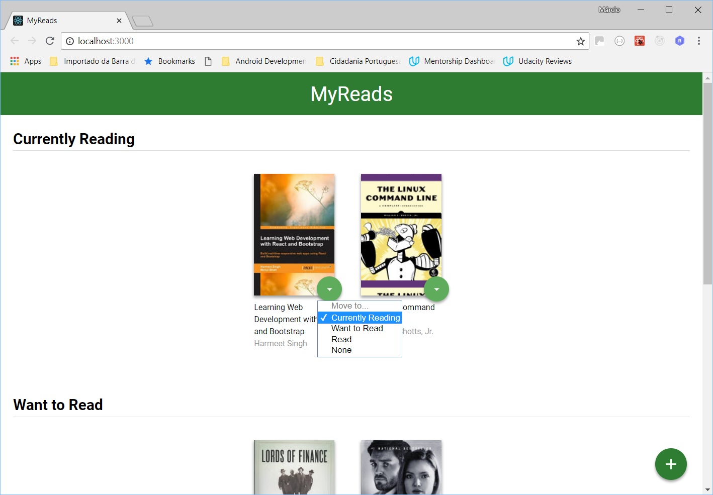
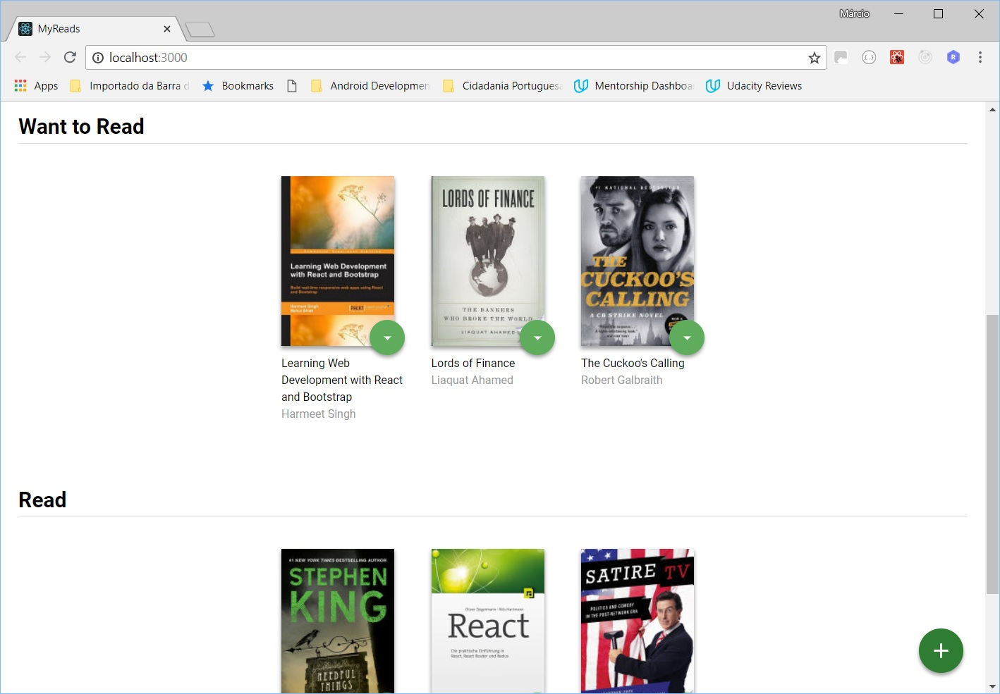
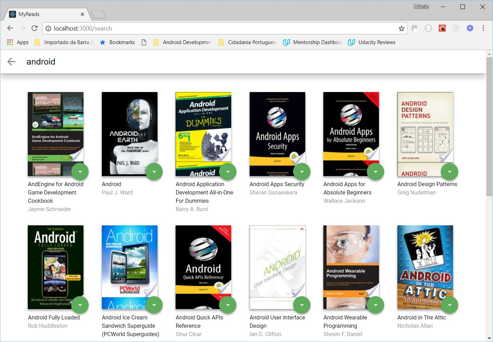
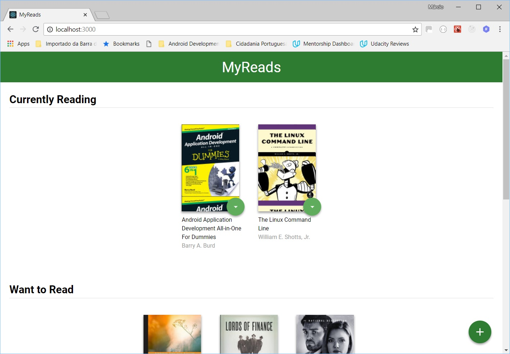

# Udacity React Nanodegree - Projeto 1 (MyReads)

Neste projeto temos uma aplicação de estante de livros que permite selecionar e classificar os livros que o usuário já leu, está lendo ou quer ler. Além disso é possível adicionar novos livros nas estantes fazendo consultas no acervo disponibilizado pela API da Udacity para este projeto.

**OBS:** A API do backend tem uma limitação para os termos de busca que reconhece apenas um conjunto fixo já pré-definido, conforme o arquivo [SEARCH_TERMS.md](SEARCH_TERMS.md).

**Imagens:**

<table align="center">
  <tr>
     <td>
       
       
Tela Inicial

     </td>
     <td>
       
       
Livro movido para a nova prateleira

     </td>
  </tr>
</table>
<table align="center">
  <tr>
     <td>
       
       
Tela de busca do acervo

     </td>
     <td>
       
       
Livro adicionado do acervo

     </td>
  </tr>
</table>

## Instalação:

* Faça um clone do repositório
* Instale todas as dependências com `npm install`
* Inicialize o servidor de desenvolvimento com `npm start`

## Create React App

Este projeto foi gerado com [Create React App](https://github.com/facebookincubator/create-react-app). Mais informações [aqui](https://github.com/facebookincubator/create-react-app/blob/master/packages/react-scripts/template/README.md).

## Copyright

Esse projeto foi desenvolvido por Márcio Souza de Oliveira e todo o código inicial com os templates, ícones, imagens, estilos e API do backend foram disponibilizados pela Udacity.

